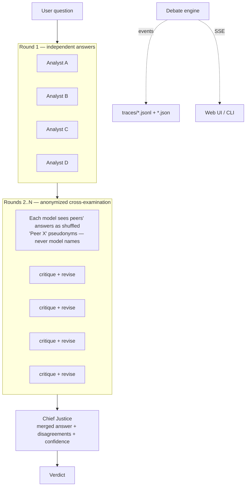

# ⚖️ LLM Council

A multi-agent debate system: several LLMs answer a question independently,
cross-examine each other's answers **anonymously**, and a **Chief Justice**
model synthesizes a final verdict. Runs on NVIDIA NIM's free OpenAI-compatible
endpoints.

## Architecture



Components:

| Path | What |
|---|---|
| `config/models.yaml` | Model registry — swap models without code changes |
| `council/client.py` | Thin async NIM client: per-model sliding-window rate limit (40 req/min), exp backoff on 429/5xx, max 3 retries |
| `council/engine.py` | Debate rounds, anonymization, Chief Justice fallback chain |
| `council/api.py` | FastAPI: `POST /ask`, `GET /stream/{id}` (SSE), `GET /sessions/{id}`, serves the UI at `/` |
| `council/cli.py` | Terminal debate runner |
| `council/tracing.py` | Structured JSON traces per session |
| `eval/run_eval.py` | GSM8K benchmark: single model vs council, with flip analysis |

## Setup

```bash
uv venv && uv pip install -e ".[dev]"     # or: pip install -e ".[dev]"
cp .env.example .env                       # then paste your nvapi-... key
```

Get a free key at [build.nvidia.com](https://build.nvidia.com).

## Run

```bash
# CLI (works standalone)
uv run python -m council "Is P = NP? Argue carefully." --rounds 2
uv run python -m council "..." --json > result.json

# Web UI
make run          # uvicorn council.api:app → http://localhost:8000

# Tests
make test

# Eval (needs: uv pip install -e ".[eval]")
make eval
```

## How it works

1. **Round 1 — independent.** The question fans out to all enabled council
   models in parallel. Each must end with a `FINAL ANSWER:` line.
2. **Rounds 2..N — cross-examination.** Each model receives the *other*
   models' answers labeled with pseudonyms (`Peer A/B/C`) that are **freshly
   shuffled every round**, so models can't identify brands (prevents
   self/brand-preference bias) or track a peer across rounds. They critique
   and output a revised answer.
3. **Synthesis.** The Chief Justice receives everything and outputs a merged
   answer, points of disagreement, and a confidence level. If the primary
   justice model fails, fallbacks from the registry are tried in order.

Council models are health-checked at startup; failures are logged and the
debate proceeds with whatever remains (minimum 2 models).

## Adding / swapping a model

Edit `config/models.yaml` — add an entry with the NIM model `id`, a display
`alias`, `role` (`council` or `chief_justice`), sampling params, and
`enabled: true`. No code changes needed. Verify the id exists at
build.nvidia.com; the startup health check will exclude dead ids gracefully.

## Eval results

Run `make eval` to (re)generate. Responses are cached in `eval/cache/`
(keyed by hash of model+prompt), so re-runs are free.

| Setup | Accuracy | Avg latency / question |
|---|---|---|
| Single best model | _run `make eval`_ | — |
| Full council | _run `make eval`_ | — |

Full table (incl. wrong→right / right→wrong flip analysis) lands in
`eval/results.md`.

## Assumptions & notes

- **"Best single model"** in the eval = the first enabled council model in
  the registry.
- Config `alias` values (`Analyst A…`) are stable public labels used by the
  UI and traces; in-prompt anonymization uses separate per-round shuffled
  `Peer X` pseudonyms.
- Model responses are requested non-streaming; the UI streams **events**
  (answer-by-answer) via SSE rather than token-by-token — simpler, and the
  debate structure is the point.
- Traces contain real model ids (they're local files); the SSE stream and UI
  only expose aliases.
- Default NIM model ids current as of 2026-07; if NIM deprecates one, the
  health check drops it and you just edit `models.yaml`.
